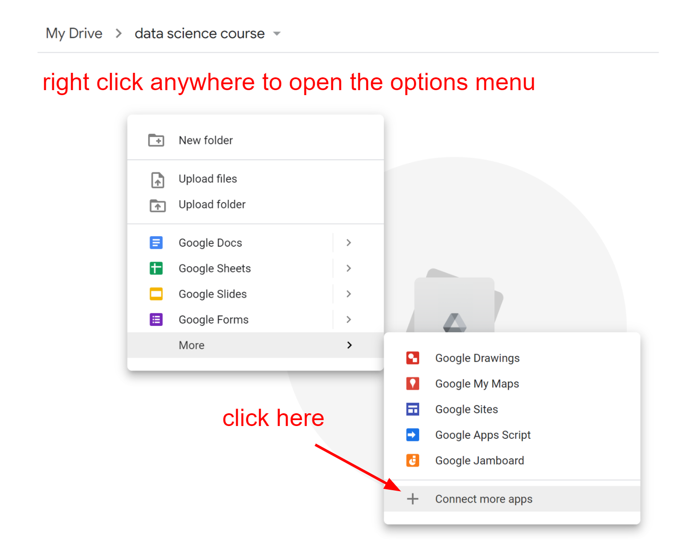
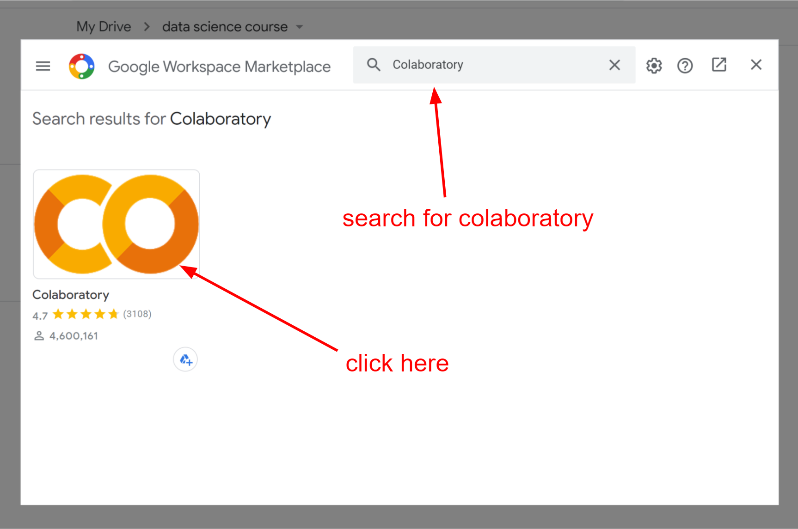
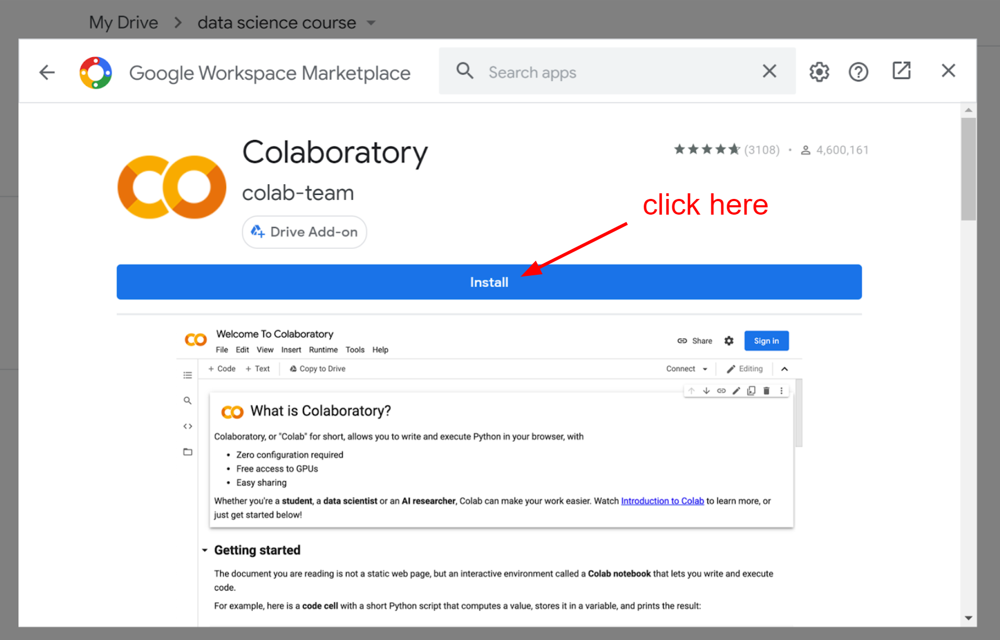
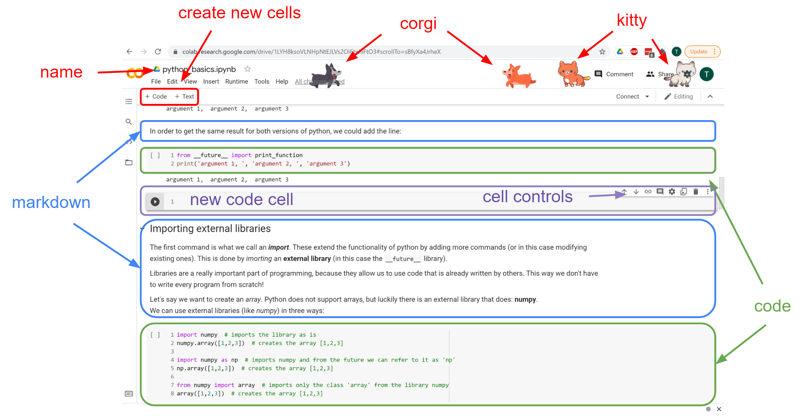

# Development Environment for Data Masterclass

## Development Editor
**[Download Visual Studio Code](https://code.visualstudio.com/)** and install.

### Installation Instructions
- **[Windows](https://code.visualstudio.com/docs/setup/windows)**
- **[MacOS](https://code.visualstudio.com/docs/setup/mac)**
- **[Linux](https://code.visualstudio.com/docs/setup/linux)**

Several plugins should be also installed during the course such as ESLint and Live Server.
Instructions on how to install and manage your plugins can be found here: **[Εxtension Marketplace](https://code.visualstudio.com/docs/editor/extension-gallery)**

## Recommended Setup for Python

- Python > 3.7
- Python packages: 
  - jupyter
  - numpy
  - pandas
  - matplotlib
  - seaborn
  - scikit-learn
  - imbalanced-learn
  - sktime

### How to set up your PC

The Python part of this academy will mostly be done on Jupyter Notebooks. There are two ways to use this tool: locally or online. 

### Online

There are several online providers for hosting Jupyter notebooks. We recommend using **Google Colaboratory**.

Google Colaboratory is a cloud service that lets you create and edit python notebooks through the browser. You may write blocks of code (cells) and run them to get the output immediately, as well as cells of text (markdown) embedded with images, Latex etc. Also, you can install any python library you need, although most of them are already installed.

**Requirement**: google account (your gmail)

You can try it out [here](https://colab.research.google.com/notebooks/intro.ipynb)!

We recommend using it through your google drive. You can set it up like this:

1. Sign in to your google account and visit your google drive.
2. Create a folder that will contain the notebooks that we will use in this course.
3. Connect colaboratory add-on to your google drive.

4. Either upload an existing notebook and open it with colab or create a new one

#### Pros:
- Environment is already setup, no need for installations/configurations.
- Pip and commonly used libraries are preinstalled.
- Processing is offloaded to a remote server, no need for computational power from your end.

#### Cons:
- Requires an internet connection.
- Slower than running it locally (in most cases).
- Data need to be uploaded to colab (or google drive).

#### Quickstart

- Add a new code or text cell by clicking on the "+ Code" or "+ Text" button under the Menu bar
- Write a python command on a code cell (e.g. print ("hello world) )
- Run it by clicking the "play" button on the left of a code cell or by clicking Shift+Enter 
- To run an os command add "!" in the beggining (e.g. !pip3 list)
- Double-click on a text cell (markdown) in order to edit it
- You can use a GPU by selecting "Runtime -> Change runtime type" and setting the "Hardware accelerator"
- To upload a file to colab, click on the "Files" tab on the left, then click "Upload" and select a file
- You may also click on "Mount Drive" to get access to all your files on drive
- Install a python library using pip3 (e.g !pip3 install --upgrade scikit-learn)
- Import a library (e.g. import pandas)
- Download your code as a python file by selecting "File -> Dowload .py"
- Restart kernel (reset all variables) by selecting "Runtime -> Restart runtime..."

### Locally (for Windows)

1. Download and install [python](https://www.python.org/downloads/) (preferably python > 3.7). 
    - We do **not** recommend using other python distributions (e.g. anaconda). 
    - During installation, **add python to your environmental variables**. That means that you have to check the box saying **ADD TO PATH** on the first screen during the installation
    - If prompted select to additionally install pip.  
2. Verify that python is installed.
    - Open a command prompt and type the command for launching a python interpreter. Depending on the OS and python's version this can either be `python`, `python3`, `py` or `py3`.
    - If none work, you need to add python to your environmental variables manually. To do this, find the interpreter in the installation directory and [add it as an environmental variable](https://www.computerhope.com/issues/ch000549.htm).
    - From now on we'll consider that python is installed and works with the command `python`. If this differs in your PC, use your own instead of `python` from now on.
3. Verify that pip is installed.
    - Pip is a package manager for Python.
    - Open a command prompt and type the command `pip`.
    - If it doesn't exist type `python -m pip`. If this works, you can add pip to your environmental variables (look above on how to do this). `
    - If pip isn't installed, download the installer from [here](https://bootstrap.pypa.io/get-pip.py) and run it as a python scripy: `python get-pip.py`.
 4. Download **[requirements.txt](requirements.txt)** and install them with pip: `pip install -r requirements.txt`.

### Locally (other OS)

Install python and pip through the OS's default package manager. Then run step 4 from before.

*Note: Most linux and OSX distributions have Python 2 preinstalled. This is not compatible with what we will be seeing in this course. Either install Python 3 locally, or use the online tool described above!* 

## Software Stack for DevOps
1. Download and install **[Git Version Control](https://git-scm.com/downloads)**.
2. Create a **[Github account](https://github.com/join)**.

## Microsoft SQL Server Developer Edition

For Windows, download the latest version of [MSSQL Server Developer edition](https://www.microsoft.com/en-gb/sql-server/sql-server-downloads). This is free software and requires no registration.

Execute the SQL2019-SSEI-Dev.exe, choose Download Media at a specified location 

Use ISO packaging, mount and install 

After checking your computer, make full installation, select all options and proceed using default settings 

Add current user in all cases 

For authentication, choose *mixed mode authentication* (it may be shown as *SQL Server and Windows Authentication mode*). If you are asked for a user name, use **sa**, and for the password use **passw0rd** (we will only use publicly available sample data for the project so we are ok with basic security) 

### SQL Server Management Studio

For Windows, download the latest version of [MSSQL Server Management Studio](https://docs.microsoft.com/en-us/sql/ssms/download-sql-server-management-studio-ssms?view=sql-server-ver15). This is free software and requires no registration.

Once it is installed, run it and it will connect to the SQL Server that you installed in the previous step

For authentication, choose *SQL server authentication*, and enter the user name and password which you created in the previous step for the SQL Server

### AdventureWorks databases

Go to [this page](https://docs.microsoft.com/en-us/sql/samples/adventureworks-install-configure) and download the following two databases (they are free to download and use): 

- [AdventureWorksDW2012.bak](https://github.com/Microsoft/sql-server-samples/releases/download/adventureworks/AdventureWorksDW2012.bak)
- [AdventureWorks2017.bak](https://github.com/Microsoft/sql-server-samples/releases/download/adventureworks/AdventureWorks2017.bak)

Be careful with the database names, there are many databases available on that page with similar sounding names. Be sure that you have selected the right ones.

The installation of the databases in MSSQL Server will be shown in one of the course sessions.

## Data Visualization With Tableau
- Download and install the free trial of [Tableau Desktop](https://www.tableau.com/products/desktop/download).

## Front-End Development with React

Before starting please make sure that you have successfully installed the below dependencies on your development environment.

- [Node.js](https://nodejs.org/en/) - is a JavaScript runtime built on Chrome's V8 JavaScript engine. We will use the latest LTS version.
- [npm](https://www.npmjs.com/) - is the official Nodejs Package Manager (npm) which allows us to manage our dependencies and packages. It is automatically installed with nodejs, so you don't have to install it separately.
- [git](https://git-scm.com/) / [github account](https://github.com/) - is a version control system for source code and Github is a community site that allows easy creation and collaboration on git projects.

### Verifying installation

After installing node please verify that you have setup everything correctly by typing the below commands on your terminal:

- `node -v` ➡️ `v12.17.0` (any version >= 12 is fine, in my case the version is specifically v12.17.0)
- `npm -v` ➡️ `6.14.4` (any version >= 6 is fine, in my case the version is specifically 6.14.4)

### Code editor Extensions

Install Visual Studio Code with the following extensions:

- [Babel JavaScript](https://marketplace.visualstudio.com/items?itemName=mgmcdermott.vscode-language-babel)
- [ESLint](https://marketplace.visualstudio.com/items?itemName=dbaeumer.vscode-eslint)
- [npm Intellisense](https://marketplace.visualstudio.com/items?itemName=christian-kohler.npm-intellisense)
- [Path Autocomplete](https://marketplace.visualstudio.com/items?itemName=ionutvmi.path-autocomplete)
- [Path Intellisense](https://marketplace.visualstudio.com/items?itemName=christian-kohler.path-intellisense)
- [Prettier - Code formatter](https://marketplace.visualstudio.com/items?itemName=esbenp.prettier-vscode)

## Data Iku Setup
- Install Data Iku using the ready-to-go [Virtual Box](https://www.virtualbox.org/wiki/Downloads) appliance.
- Instructions are provided on [Data Iku's website](https://www.dataiku.com/product/get-started/virtualbox/).
